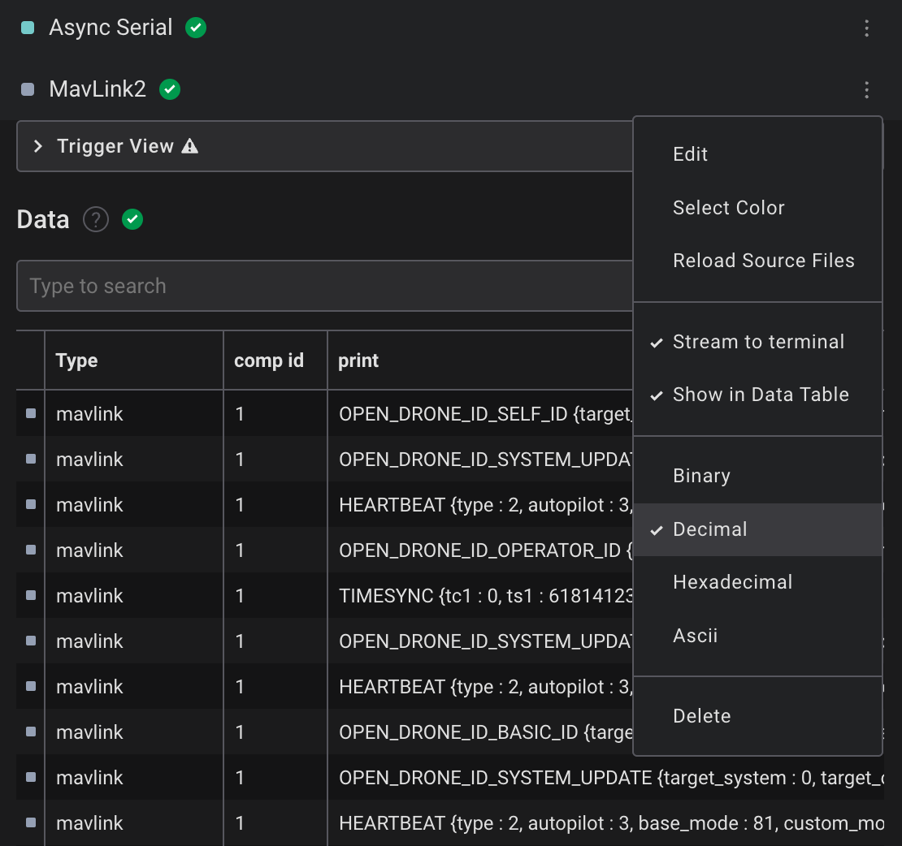

# MAVLink 2 Saleae Logic 2 Extension

## Usage
1. Inspect the serial data using `Async Serial` analyzer. Be sure to set the right baud rate and channel:
1. Add MAVLink2 analyzer, specifying the Input Analyzer;
1. both on Data Table and plot view you can see the decoding data;
1. if there are some parsing errors, they are printed on Analyzer terminal;
1. for an easier view set the datatype as Decimal.



  
## Update MAVLink Python module

The included file `generated_mavlink2_all.py` is generated by pymavlink. If you would like to use a newer binding:

1. clone ArduPilot/mavlink
2. install pymavlink
```
$ python3 -m pip install pymavlink
```
3. generate the python MAVLink 2 dependencies
```
$ mavgen.py --wire-protocol 2.0 --lang Python3 path-to-mavlink/mavlink/message_definitions/v1.0/all.xml -o generated_mavlink2_all.py
``` 

